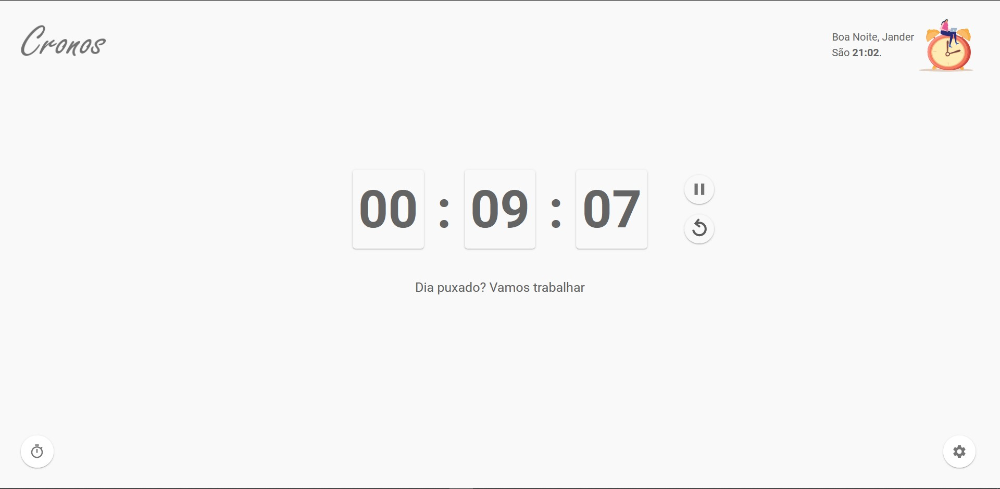

# ⏱️ Cronos
  Cronos é um cronômetro com histórico de pausas e estado persistente.
  
  [Acesse agora, tem Dark mode 🌙](https://cronos-nu.vercel.app/)
 
<h1 align="center">
    
</h1>

## 💡 Ideia
 Para fazer o controle da quantidade de horas que trabalho no dia, utilizo o cronômetro do Windows. Mas as vezes (quase sempre) entre as pausas do dia acabo esquecendo de pausar o cronômetro. Quando retorno, não sei quanto tempo se passou.
 
 ## 💻 Objetivo da aplicação
  Cronometrar o tempo de trabalho e armazenar em uma lista o horário que o cronômetro foi pausado e quanto tempo decorreu após a pausa.

## :rocket: Tecnologias
- [NextJs](https://nextjs.org)
- [TypeScript](https://www.typescriptlang.org/)
